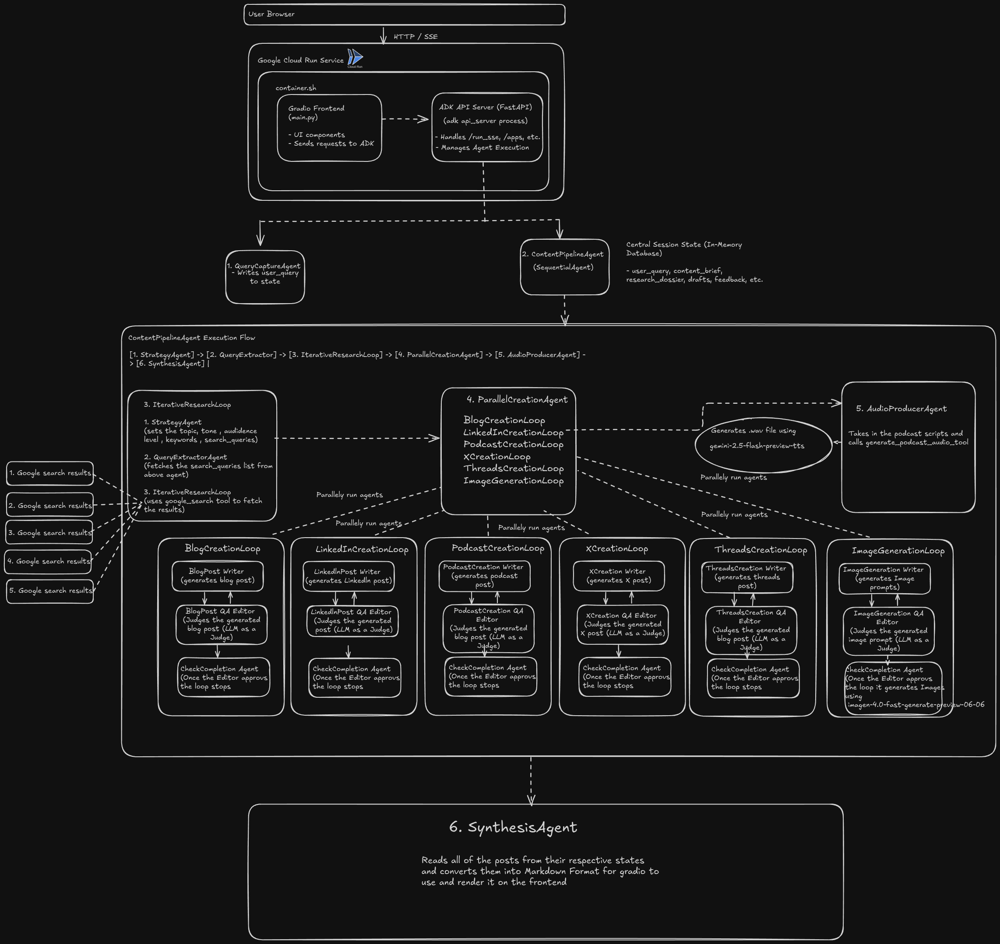

# ContentGen AI

> An autonomous, multi-agent system built with the Google Agent Development Kit (ADK) that takes a  topic and generates a complete, multi-platform content marketing campaign, including blog posts, social media updates, podcast scripts, and AI-generated Images , audio podcasts.

This project is designed to showcase the power and scalability of multi-agent collaboration using the Google ADK, addressing the judging criteria by demonstrating a technically robust, innovative, and well-documented solution.

---

## Table of Contents
- [🌟 Project Overview](#-project-overview)
- [🏗️ Architecture Diagram](#️-architecture-diagram)
- [💡 Core Concepts & ADK Implementation](#-core-concepts--adk-implementation)
- [🤖 The Agent Roster](#-the-agent-roster)
- [🔧 Tools of the Trade](#-tools-of-the-trade)
- [🖥️ The Frontend: Real-time with Gradio](#️-the-frontend-real-time-with-gradio)
- [📂 Project Structure](#-project-structure)
- [🚀 Getting Started](#-getting-started)
  - [Prerequisites](#prerequisites)
  - [Local Setup](#local-setup)
  - [Environment Variables](#environment-variables)
  - [Cloud Deployment (Google Cloud Run)](#cloud-deployment-google-cloud-run)

---

## 🌟 Project Overview

In today's fast-paced digital landscape, content creators are pressured to produce high-quality, consistent content across multiple platforms. This is a time-consuming and complex task. The **ContentGen AI** is an innovative solution that automates this entire workflow.

By simply providing a high-level topic (e.g., "Deepseek v3 and Deepseek R1"), the system autonomously performs the following tasks:
1.  **Strategizes:** Creates a detailed content brief, including audience, tone, keywords and search queries that needs to made to fetch content from google search.
2.  **Researches:** Dynamically generates and executes multiple Google searches to gather up-to-date information.
3.  **Creates in Parallel:** Simultaneously drafts content tailored for different platforms: a long-form blog post, a professional LinkedIn post, a punchy X (Twitter) post, conversational Threads post and engaging Youtube Podcast script.
4.  **Refines Iteratively:** Each piece of content goes through a writer-editor loop, where a QA agent provides feedback or approves the content, ensuring high quality.
5.  **Generates Media:** Creates a podcast script, an image prompt for a thumbnail, and then generates the final audio and image files using **gemini-2.5-flash-preview-tts** and **imagen-4.0-fast-generate-preview-06-06**.
6.  **Synthesizes:** Assembles all the final assets into a clean, comprehensive report for the user.

This project demonstrates a true digital assembly line powered by collaborating AI agents.

---

## 🏗️ Architecture Diagram

The following diagram illustrates the flow of control and data between the various agents in the pipeline.

[](./architecture.svg)
*(Click to view the scalable SVG version)*

---

## 💡 Core Concepts & ADK Implementation

This project heavily utilizes the core concepts of the Google Agent Development Kit to orchestrate a complex workflow.

#### The Multi-Agent System
The solution is not a single, monolithic agent but a carefully orchestrated team of specialized agents, each with a single responsibility. This modular approach, inspired by the Unix philosophy, makes the system robust, scalable, and easier to debug.

#### Key ADK Features Used:
-   **`SequentialAgent`**: Used to enforce a strict, linear order of operations for the main pipeline: **Strategy -> Research -> Create -> Synthesize**. It is also used within the research loop to ensure a query is managed before it is executed.
-   **`ParallelAgent`**: This is the heart of the factory's efficiency. After research is complete, the `ParallelCreationAgent` spawns five independent content creation loops and the image creation pipeline, allowing them to run simultaneously. This dramatically reduces the total execution time.
-   **`LoopAgent`**: Implemented for all content creation and research tasks. This enables the powerful **"write-review-approve"** pattern. A writer agent creates a draft, an editor agent reviews it, and if it's not perfect, the loop repeats with the feedback. The loop terminates only when the content is approved or a max iteration count is reached.
-   **`BaseAgent`**: We created two custom agents by inheriting from `BaseAgent`:
    -   `CheckCompletionAgent`: A generic loop-controller that checks a boolean flag in the state to decide whether to escalate and break the loop.
    -   `ResearchQueryManager`: A stateful agent that manages a list of search queries, by fetching info using google_search tool for every search query in the list
-   **State Management**: The entire process is coordinated through a shared session state. Each agent reads its required inputs from the state (e.g., `STATE_CONTENT_BRIEF`) and writes its output back to the state (e.g., `STATE_BLOG_DRAFT`), creating a seamless flow of data.
-   **Tool-Using `LlmAgent's`**: Nearly every agent is an `LlmAgent` equipped with specific tools, from simple state-setting `approve_*` tools to powerful I/O tools like `generate_images_tool`, `google_search` and `generate_podcast_audio_tool`.

---

## 🤖 The Agent Roster

The factory floor is manned by a team of specialized agents:

#### Phase 1: Strategy & Research
-   **`QueryCaptureAgent`**: The entry point. Simply captures the user's initial query and places it into the state.
-   **`StrategyAgent`**: The Content Strategist. Creates a JSON-based "Content Brief" that guides all subsequent agents.
-   **`QueryExtractorAgent`**: A parsing agent that extracts the list of search queries from the brief.
-   **`ResearchQueryManager`**: The foreman of the research loop. It feeds one query at a time to the search agent.
-   **`SingleSearchAgent`**: Executes a single Google search via the built-in `google_search` tool.
-   **`DossierAggregatorAgent`**: Compiles the results from all searches into a single, cohesive "Research Dossier".

#### Phase 2: Parallel Content Creation (Writers & Editors)
-   **`BlogPostWriterAgent` / `Blog_QA_EditorAgent`**: The team responsible for creating and refining a long-form, Markdown-formatted blog post.
-   **`LinkedInPostWriterAgent` / `LinkedIn_QA_EditorAgent`**: This pair creates an engaging, professional post optimized for LinkedIn.
-   **`XPostWriterAgent` / `X_QA_EditorAgent`**: Specializes in crafting concise, punchy posts for X (Twitter), respecting character limits.
-   **`ThreadsPostWriterAgent` / `Threads_QA_EditorAgent`**: Creates conversational, discussion-starting posts for Threads.
-   **`PodcastScriptWriterAgent` / `Podcast_QA_EditorAgent`**: Writes and refines a two-host conversational podcast script.
-   **`ImagePromptGeneratorAgent` / `ImagePromptValidatorAgent`**: A specialized team that writes and validates a high-quality prompt for generating a thumbnail image.

#### Phase 3: Media & Final Synthesis
-   **`ImageGeneratorAgent`**: An automation unit that takes the approved prompt and calls the `generate_images_tool`.
-   **`AudioProducerAgent`**: Takes the approved podcast script and calls the `generate_podcast_audio_tool` to create a WAV file.
-   **`SynthesisAgent`**: The Final Packager. It gathers all the approved content from the state and assembles the final, human-readable report.

---

## 🔧 Tools of the Trade

-   **Models**: The system primarily uses **`gemini-2.0-flash-latest`** for its speed, large context window, and powerful reasoning capabilities. **Vertex AI Imagen (imagen-4.0-fast-generate-preview-06-06)** is used for image generation, and a preview **Gemini TTS (gemini-2.5-flash-preview-tts)** model is used for multi-speaker audio synthesis.
-   **Approval Tools (`approve_*`)**: A suite of simple functions that set a boolean flag in the state (e.g., `STATE_BLOG_APPROVED = True`). This is a robust and scalable pattern for controlling `LoopAgent` execution.
-   **Generation Tools (`generate_images_tool`, `generate_podcast_audio_tool`)**: These functions handle the I/O for creating media artifacts. They interact with external APIs (Vertex AI, Gemini) and use the `tool_context.save_artifact` method to store the resulting files.

---

## 🖥️ The Frontend: Real-time with Gradio

To effectively demonstrate the complex backend orchestration, we built a real-time UI using Gradio.
-   **Server-Sent Events (SSE)**: The frontend connects to the ADK's `/run_sse` endpoint, allowing the server to push events as they happen.
-   **Live Execution Log**: As each agent becomes active or updates the state, a log entry is instantly added to the UI. This provides a fascinating, real-time view of the agents collaborating, including the clear visualization of the parallel creation phase.
-   **Dynamic Content Updates**: Drafts of the blog post, social media content, and more appear in the UI the moment they are generated, even before the entire pipeline is complete.
-   **Artifact Display**: Once the pipeline finishes, the UI automatically fetches and displays the generated images in a gallery and the podcast audio in an embedded player.

---

## 📂 Project Structure

The project is organized into a modular Python package for clarity and maintainability. This clean separation of concerns is a key part of the technical implementation.

| Path                                    | Description                                                          |
| --------------------------------------- | -------------------------------------------------------------------- |
| `Dockerfile`                            | Containerizes the application for deployment.                        |
| `main.py`                               | The Gradio frontend application.                                     |
| `README.md`                             | This documentation file.                                             |
| `requirements.txt`                      | Python dependencies.                                                 |
| `run.sh`                                | Script to start the ADK server and Gradio app.                       |
| **`content_generation_agent/`**         | **The core agent application as a Python package.**                  |
| `.../__init__.py`                       | Exposes the final `root_agent` to the ADK.                           |
| `.../constants.py`                      | Centralizes all `STATE_...` keys for consistency.                    |
| `.../pipeline.py`                       | Assembles all agents into the final workflow.                        |
| `.../tools.py`                          | Defines all callable tools (approvals, media generation).            |
| **`.../agents/`**                       | **Sub-package containing all agent definitions.**                    |
| `.../agents/__init__.py`                | Makes `agents` a valid Python sub-package.                           |
| `.../agents/editors.py`                 | Contains all Quality Assurance (QA) and approval agents.             |
| `.../agents/research.py`                | Contains agents for strategy, search, and aggregation.               |
| `.../agents/utility.py`                 | Contains custom `BaseAgent` classes and simple tool-calling agents.  |
| `.../agents/writers.py`                 | Contains all content drafting and creation agents.                   |

---

## 🚀 Getting Started

### Prerequisites
-   Python 3.11+
-   `uv` (recommended for fast virtual environment and package management): `pip install uv`
-   Google Cloud SDK (`gcloud` CLI) for cloud deployment.

### Local Setup
1.  **Create Virtual Environment:**
    ```bash
    uv venv .venv --python 3.11
    source .venv/bin/activate
    ```
2.  **Install Dependencies:**
    ```bash
    uv pip install -r requirements.txt
    ```
3.  **Set Environment Variables:**
    Create a `.env` file in the root directory and add your credentials. This file will be automatically loaded. See the [Environment Variables](#environment-variables) section below.
4.  **Run the Application:**
    Make the run script executable and launch it.
    ```bash
    chmod +x run.sh
    ./run.sh
    ```
    -   The ADK server will start on `http://127.0.0.1:8000`.
    -   The Gradio UI will be available at `http://127.0.0.1:8080`.

### Environment Variables
For local execution, create a `.env` file with the following keys:
```bash
    GOOGLE_GENAI_USE_VERTEXAI=True
    GOOGLE_CLOUD_PROJECT=PROJECT_ID
    GOOGLE_CLOUD_LOCATION=LOCATION
    GEMINI_API_KEY=GEMINI_KEY # Only needed if you want to use models outside Vertex AI


### Cloud Deployment (Google Cloud Run)
The application is pre-configured for easy deployment to Google Cloud Run.

1.  **Set Shell Variables:**
    ```bash
    export PROJECT_ID="your-gcp-project-id"
    export REGION="your-gcp-region" # e.g., us-central1
    export SERVICE_NAME="content-factory-agent"
    export GEMINI_API_KEY="your-gemini-api-key" # Only needed if NOT using Vertex AI
    ```

2.  **Deploy using gcloud:**
    This single command will build the container image from the source and deploy it as a Cloud Run service.
    ```bash
    gcloud run deploy $SERVICE_NAME \
      --source . \
      --platform managed \
      --region $REGION \
      --allow-unauthenticated \
      --timeout=1800 \
      --set-env-vars="GOOGLE_CLOUD_PROJECT=$PROJECT_ID,GOOGLE_CLOUD_LOCATION=$REGION,GOOGLE_GENAI_USE_VERTEXAI=True,GEMINI_API_KEY=$GEMINI_API_KEY"
    ```
    The command will output the URL of your deployed service.

---